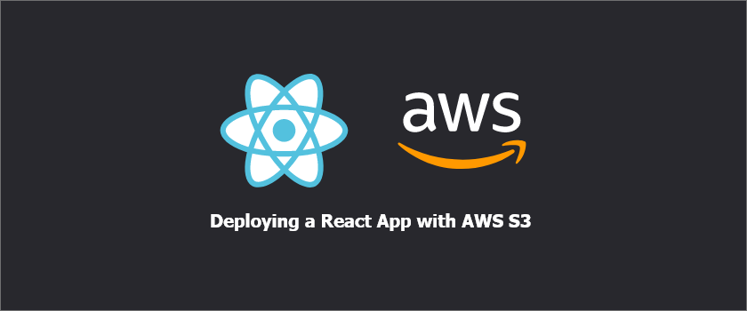
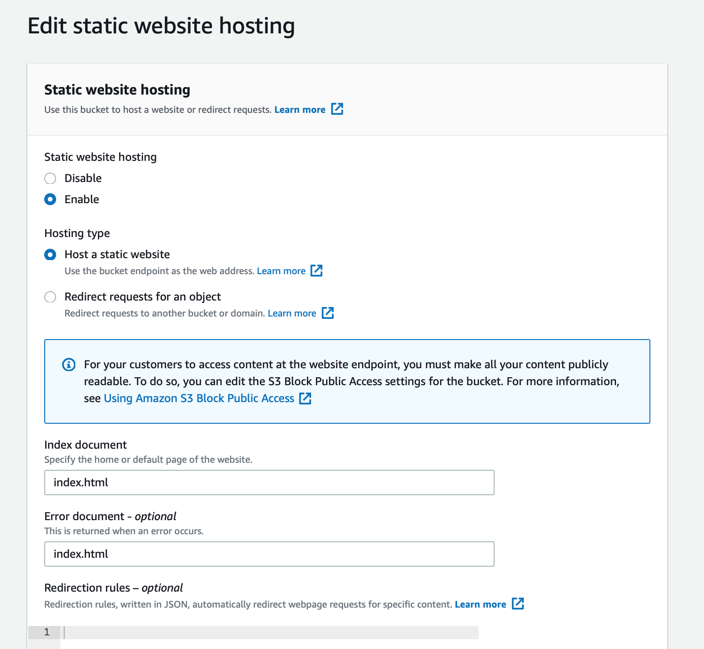
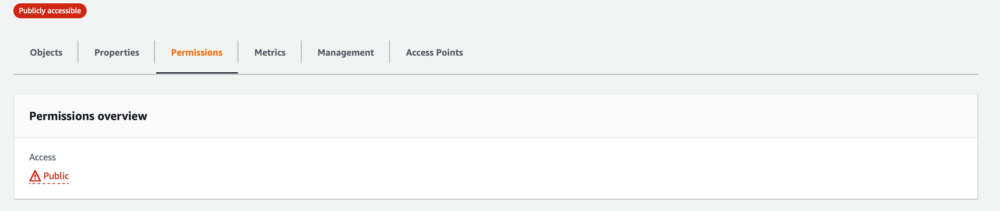
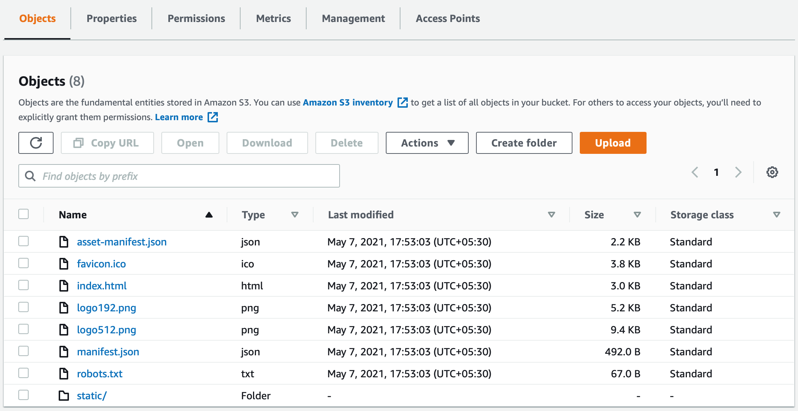

  
_Today we will learn how to deploy your React project on S3 and if time persists even how to connect your S3 bucket to cloudfront to generate a secured domain._ 

_Without waiting any longer let's dive in._

**Steps**

Let us take a step wise approach to the problem and bifurcate it for ease of understanding. 

1.. Create a bucket and add relevant permissions.

2.. Create the react build locally

3.. Upload the build and get a http s3 url to access your project

<u><b>Step 1: Create a bucket and give relevant permissions</b></u>

Go to AWS S3 console and create a new bucket, with the name of bucket as your domain name eg: xyz.com, and if you want to point your project to any of the subdomains name the bucket appropriately eg: staging.xyz.com.

(Dont play with any of the default permissions as of now. Just click next and instantiate the bucket)

Now we will handle the permissions for your bucket making sure it is publicly available.

Open your recently created bucket and move to <u>Properties</u> Tab on the top. Scroll down to the bottom and under the sub-heading "Static website hosting" click on Edit and enable the static website hosting.
Select hosting type as Host a static website and for index document and errow document mention your react code entry file i.e index.js for me. Now hit Save and return.

 
 
Okay, so now we need to make our bucket public. Head over to the <u>Permissions</u> tab at the top.

Let's start with the CORS policy

Copy the below snippet in the CORS edit section

 

<iframe
src="https://carbon.now.sh/embed?bg=rgba%28255%2C255%2C255%2C1%29&t=night-owl&wt=none&l=application%2Fjson&width=675&ds=false&dsyoff=20px&dsblur=68px&wc=true&wa=false&pv=24px&ph=21px&ln=false&fl=1&fm=Hack&fs=14px&lh=181%25&si=false&es=1x&wm=false&code=%255B%250A%2520%2520%2520%2520%257B%250A%2520%2520%2520%2520%2520%2520%2520%2520%2522AllowedHeaders%2522%253A%2520%255B%250A%2520%2520%2520%2520%2520%2520%2520%2520%2520%2520%2520%2520%2522*%2522%250A%2520%2520%2520%2520%2520%2520%2520%2520%255D%252C%250A%2520%2520%2520%2520%2520%2520%2520%2520%2522AllowedMethods%2522%253A%2520%255B%250A%2520%2520%2520%2520%2520%2520%2520%2520%2520%2520%2520%2520%2522POST%2522%252C%250A%2520%2520%2520%2520%2520%2520%2520%2520%2520%2520%2520%2520%2522GET%2522%252C%250A%2520%2520%2520%2520%2520%2520%2520%2520%2520%2520%2520%2520%2522PUT%2522%250A%2520%2520%2520%2520%2520%2520%2520%2520%255D%252C%250A%2520%2520%2520%2520%2520%2520%2520%2520%2522AllowedOrigins%2522%253A%2520%255B%250A%2520%2520%2520%2520%2520%2520%2520%2520%2520%2520%2520%2520%2522http%253A%252F%252Fstaging.xyz.com%2522%250A%2520%2520%2520%2520%2520%2520%2520%2520%255D%252C%250A%2520%2520%2520%2520%2520%2520%2520%2520%2522ExposeHeaders%2522%253A%2520%255B%255D%250A%2520%2520%2520%2520%257D%250A%255D"
style="width: 1024px; height: 520px; border:0; transform: scale(1); overflow:hidden;"
sandbox="allow-scripts allow-same-origin">
</iframe>

 

By mentioning "http://staging.xyz.com" I am explicitly restricting my POST, GET and PUT calls to the mentioned domain. 

Now under the Bucket policy section, paste the below snippet 

 

<iframe
src="https://carbon.now.sh/embed?bg=rgba%28255%2C255%2C255%2C1%29&t=night-owl&wt=none&l=application%2Fjson&width=675&ds=false&dsyoff=20px&dsblur=68px&wc=true&wa=false&pv=24px&ph=21px&ln=false&fl=1&fm=Hack&fs=14px&lh=181%25&si=false&es=1x&wm=false&code=%257B%250A%2520%2520%2520%2520%2522Version%2522%253A%2520%25222012-10-17%2522%252C%250A%2520%2520%2520%2520%2522Statement%2522%253A%2520%255B%250A%2520%2520%2520%2520%2520%2520%2520%2520%257B%250A%2520%2520%2520%2520%2520%2520%2520%2520%2520%2520%2520%2520%2522Sid%2522%253A%2520%2522AllowPublicReadAccess%2522%252C%250A%2520%2520%2520%2520%2520%2520%2520%2520%2520%2520%2520%2520%2522Effect%2522%253A%2520%2522Allow%2522%252C%250A%2520%2520%2520%2520%2520%2520%2520%2520%2520%2520%2520%2520%2522Principal%2522%253A%2520%2522*%2522%252C%250A%2520%2520%2520%2520%2520%2520%2520%2520%2520%2520%2520%2520%2522Action%2522%253A%2520%2522s3%253A*%2522%252C%250A%2520%2520%2520%2520%2520%2520%2520%2520%2520%2520%2520%2520%2522Resource%2522%253A%2520%255B%250A%2520%2520%2520%2520%2520%2520%2520%2520%2520%2520%2520%2520%2520%2520%2520%2520%2522arn%253Aaws%253As3%253A%253A%253Astaging.xyz.com%2522%252C%250A%2520%2520%2520%2520%2520%2520%2520%2520%2520%2520%2520%2520%2520%2520%2520%2520%2522arn%253Aaws%253As3%253A%253A%253Astaging.xyz.com%252F*%2522%250A%2520%2520%2520%2520%2520%2520%2520%2520%2520%2520%2520%2520%255D%250A%2520%2520%2520%2520%2520%2520%2520%2520%257D%250A%2520%2520%2520%2520%255D%250A%257D"
style="width: 1024px; height: 502px; border:0; transform: scale(1); overflow:hidden;"
sandbox="allow-scripts allow-same-origin">
</iframe>

 

<b>NB:</b> In the Resources list the arn should be the one relevant to your bucket, the above shown is for my bucket staging.xyz.com

Now your bucket permissions overview must be public

  
<u><b>Step 2 and 3: Build your React project locally</b></u>

For now we will build our react project locally and upload the build to S3, in another blog post we can cover how to setup CI/CD for your React project using AWS Code Deploy and Pipeline and deploy automatically wehn there are changes in your master branch.

After you ahve uploaded your build your bucket might look like this.

Now under the properties tab you can scroll down and see your project live on the given link.

 
 
Well there is much more parts which can be covered but let's save that for another blog. Just to mention a few.
 
 
1.. Point your s3 to staging.xyz.com using Route53

2.. Configure cloudfront distribution to move to https 
