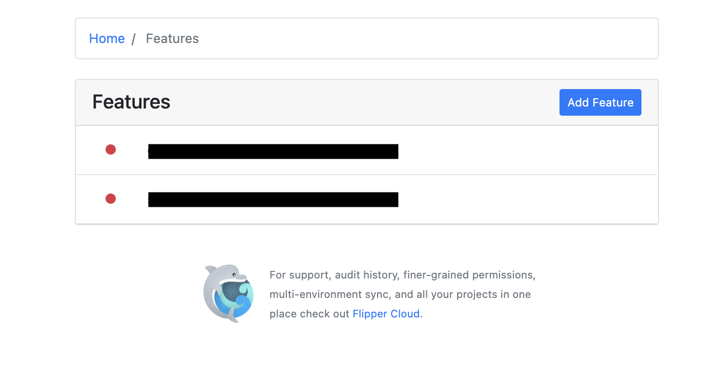
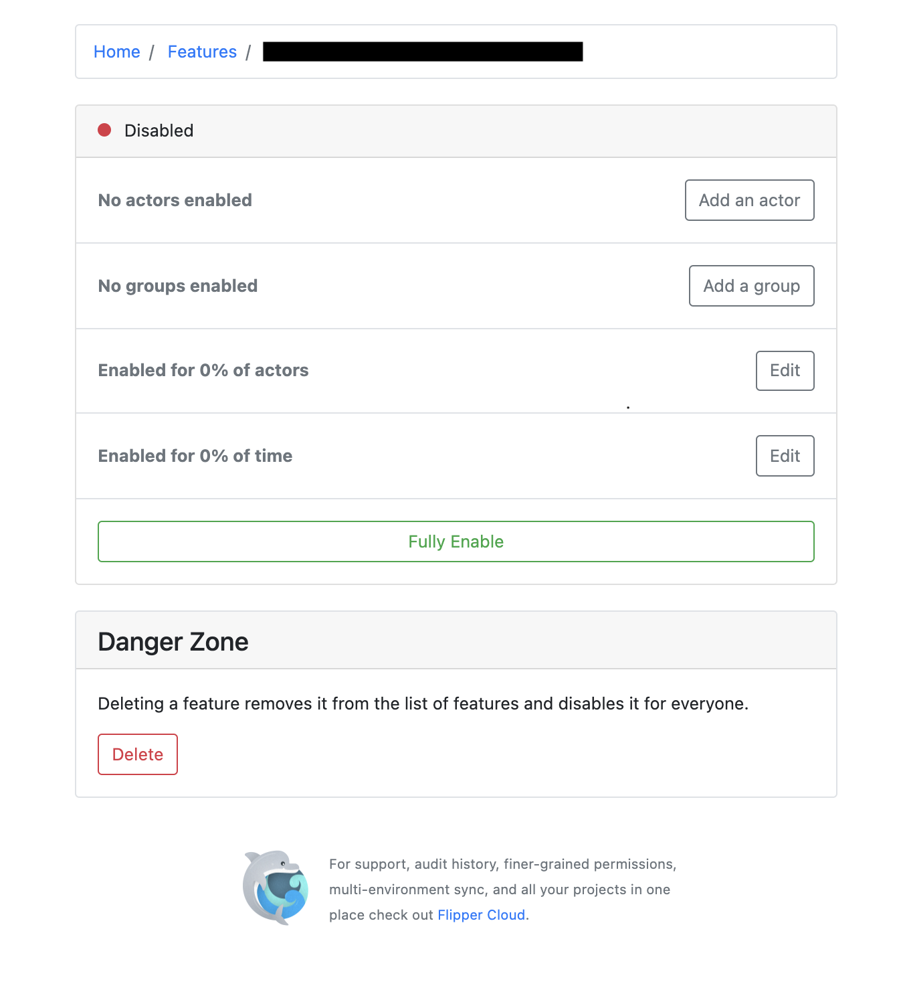

**Introduction**

The usage of feature flags in the modern world of software development has transformed the
development, testing and the entire process of shipping features drastically. In simple words,
feature flags merely act as a switch that toggles product features in your application on and off at
any given point without needing one to deploy new code.

Provides the flexibility to freely experiment and have control over the entire feature lifecycle.
The objective of introducing feature flags is to minimize the time taken for a developed feature to
be rolled out to customers and even perform A/B tests for a set of users on a set of features before
rolling it out to a broader set of customers.

<br>

**Use Case and Benefits**

<br>

**Canary Testing**

Feature releases of a product impacts the product adoption massively and hence has to be done in
an incremental way, in a phased approach. Rolling the new feature out to a subset of customers
and tracking the adoption and usability can turn out to be a minimal risk way of bringing new
features out. If the feature is well adopted and the feedback is positive the said feature can be
rolled out to a broader set of customers.

This can be achieved in 2 ways, either split traffic at server level to roll over traffic from one version
of an app to another or at a feature level where maybe 2% of users are experiencing a diff flow
altogether using feature flags.
With this monitoring key engineering and business metrics like error rates, app latencies and
various click and funnel metrics can be tracked giving an idea of the value the feature has been
able to provide.

<br>

**A/B Testing**

A/B testing is an experimentation process where different versions of a feature/design are shown to
different segments of users at the same time which eventually helps in drawing inferences about
the adoption and the impact created.

Feature flags help the product/operations teams not get blocked by engg bandwidth and freely
carry out experiments on a certain set of user base. For example if the application supports
multiple languages tests can be carried out for users using the app only in english or japanese
maybe as those set of users can be directed to a diff flow whereas others to a different flow.

<br>

**Continuous Delivery**

Feature flagging acts as a catalyst in the process of continuous delivery for leading software
companies across the globe. Continuous Delivery is the discipline where the software can be
shipped to the production environment at any time, keeping the deployment time less than 15
minutes generally.

Acting as a key factor in the process of CI/CD, new features can be rolled out and kept behind
feature flags turned off, not blocking the PR’s from getting merged. At the right time when the
feature has to be turned on, a single feature toggle should be able to enable the feature and not
require a separate deployment.

<br>

**Rollbacks and Kill Switch**

App deployments are a tedious task, one has to go through the whole process of getting the app
store reviews and stuff. Now imagine if there’s a major security bug in our app build and as a fix the
team has decided to roll back the recently developed feature. In such cases feature flags come to
the rescue, rather than re-deploying the earlier build or maybe removing some features and
generating a new build and going through the tedious process all again, we just turn off our feature
which exists behind a feature flag. Isn’t it much easier? This can be extended to backend
deployments too but assuming we are working in CI/CD fashion backend deployments are not time-consuming.

<br>

**Testing in Production**

At times there are certain features which have to go through a round of testing on the production
environment irrespective of having unit tests and manual verification on staging/testing
environment. Replicating the subset of prod data on staging and testing is difficult and for a
complex system does not instill enough confidence. Feature flags can act as a facilitator here
helping the team test such new features in production. If things run well in prod feature flags can
be turned on thereafter.

<br>

**Feature Flags in Ruby**

<br>

**[Flipper](https://github.com/jnunemaker/flipper)** - Beautiful, performant feature flags for Ruby.


<br>

Since we now know what feature flags are, we can jump onto the implementation then.
We know that the configurations and settings should be saved somewhere, during runtime whose
values get picked and appropriate product flow is executed.

The very first thing popping in our heads is why not keep them as environment variables or configs
in a YAML file. Sure we can but this still requires a re-deployment everytime it needs to be toggled.
It needs a more robust and safe storage mechanism, hence separate tables managing this
environment basis would be ideal.


<br>

Flipper is one such gem which provides us an easy way to integrate feature flags in our code bases.

One can use rails console or a simple to use Admin UI to toggle features on the fly.

Here’s a 4-step approach to help you integrate feature flags in your Ruby code

<br>

**1.. Add the following gems to your Gemfile and install them**

<br>

 ```ruby
 gem "flipper"
 gem "flipper-ui"
 gem "flipper-active_record"

 RUN bundle install
 ```

<br>

**2.. RUN below commands to generate migration files for flipper tables**

<br>

 ```ruby
 RUN bin/rails g flipper:active_record
 RUN bin/rails db:migrate
 ```

<br>

You will see a new migration file added as below

<br>

 ```ruby
 class CreateFlipperTables < ActiveRecord::Migration[6.1]
   def self.up
     create_table :flipper_features do |t|
       t.string :key, null: false
       t.timestamps null: false
     end

     add_index :flipper_features, :key, unique: true

     create_table :flipper_gates do |t|
       t.string :feature_key, null: false
       t.string :key, null: false
       t.string :value
       t.timestamps null: false
     end

     add_index :flipper_gates, [:feature_key, :key, :value], unique: true
   end

   def self.down
     drop_table :flipper_gates
     drop_table :flipper_features
   end
 end
 ```

<br>

**3.. Add the below to routes.rb file to make the endpoint `/flipper` available to admin and
   configure the username and password**

<br>

 ```ruby
 flipper_app = Flipper::UI.app(Flipper.instance) do |builder|
   builder.use Rack::Auth::Basic do |username, password|
     ActiveSupport::SecurityUtils.secure_compare(
       Digest::SHA256.hexdigest(username),
       Digest::SHA256.hexdigest(ENV['ADMIN_USERNAME']
     )) &&
     ActiveSupport::SecurityUtils.secure_compare(
       Digest::SHA256.hexdigest(password),
       Digest::SHA256.hexdigest(ENV['ADMIN_PASSWORD']
     ))
   end
 end

 Rails.application.routes.draw do
   mount flipper_app => '/flipper'
 ```

<br>

**4.. And now use flipper in your code**

<br>

 ```ruby
 if Flipper.enabled?(:billing)
   # get paid
 else
   # wish you were getting paid
 end
 ```

<br>

_Note_:

<br>

1.. By default all feature flags are disabled.

2.. To enable and disable use `Flipper.enable(:key)` and `Flipper.disable(:key)`

3.. And to check if enabled use `Flipper.enabled?(:key)`

<br>

Below are a few screenshots how your features look and can be toggled on the Flipper UI




