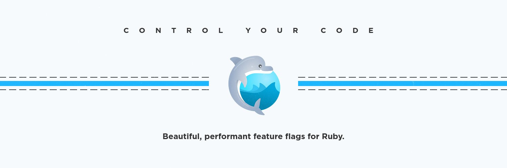
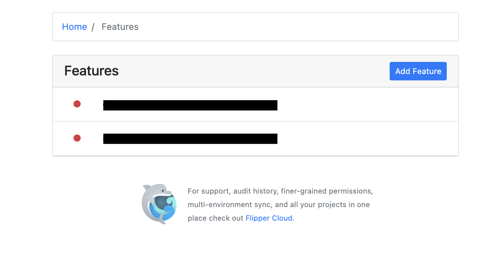
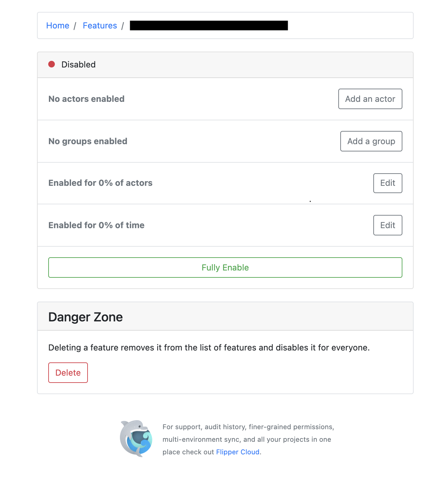

**Problem**

Feature flagging or toggling is an industry-wide used technique to  turn functionality on-off during runtime, 
without deploying new code.

In simple terms if the product demands to pause certain features for certain users for A/B testing or maybe for a certain time span, 
one shouldn't go about re-deploying changes in prod everytime. That's the last thing you should do.

**Solution**

Here comes feature flags to the rescue. Feature flags are highly adopted by frontend engineers and should be too by backend.
Just wrap your code in a feature flag which executes like an if else block during runtime depending on if it switched on or not.

Flipper is a wonderful gem Ruby developers can use to toggle the features via rails console or an Admin UI.

Wrapping particular piece of code in if else block can be the basic solution of switching on/off features but that requires manual effort when a toggle is needed.
Moreover a deployment is needed too.

A few benefits of using feature flags

1.. Give your product team the power to release code.

2.. Safely isolate new and existing code - Turning off a feature flag is faster than rolling back

3.. Batch rollout new features - Performing A/B testing becomes easier, gain confidence in new features.

**Steps to get started with Flipper**

1.. Add the following gems to your Gemfile

<pre>

    gem "flipper"
    gem "flipper-ui"
    gem "flipper-active_record"

</pre>

2.. Run bundle install to install the gems

<pre>

    bundle install

</pre>

3.. Generate the flipper migration file which creates tables to manage the active state of feature flags. Below commands generates the migration file as shown
<pre>

    bin/rails g flipper:active_record
    bin/rails db:migrate

</pre>

<pre>

    class CreateFlipperTables < ActiveRecord::Migration[6.1]
      def self.up
        create_table :flipper_features do |t|
          t.string :key, null: false
          t.timestamps null: false
        end
        add_index :flipper_features, :key, unique: true
    
        create_table :flipper_gates do |t|
          t.string :feature_key, null: false
          t.string :key, null: false
          t.string :value
          t.timestamps null: false
        end
        add_index :flipper_gates, [:feature_key, :key, :value], unique: true
      end
    
      def self.down
        drop_table :flipper_gates
        drop_table :flipper_features
      end
    end

</pre>

4.. Add the below to routes.rb file to make the endpoint /flipper available to admin and configure the username and password

<pre>

    flipper_app = Flipper::UI.app(Flipper.instance) do |builder|
      builder.use Rack::Auth::Basic do |username, password|
        ActiveSupport::SecurityUtils.secure_compare(
            Digest::SHA256.hexdigest(username),
            Digest::SHA256.hexdigest(ENV['ADMIN_USERNAME']
        )) &&
          ActiveSupport::SecurityUtils.secure_compare(
            Digest::SHA256.hexdigest(password), 
            Digest::SHA256.hexdigest(ENV['ADMIN_PASSWORD']
            ))
      end
    end
    
    Rails.application.routes.draw do
      mount flipper_app => '/flipper'

</pre>

5.. Happily use flipper in your code

<pre>

    if Flipper.enabled?(:billing)
      # get paid
    else
      # wish you were getting paid
    end

</pre>

<pre>

NB: By default all feature flags are disabled, to enable and disable use Flipper.enable(:key) and Flipper.disable(:key)
    And to check if enabled or disabled, Flipper.enabled?(:key)

</pre>

You can access the dashboard on the /flipper endpoint as below anc can use the Admin dashboard to toggle features now.

